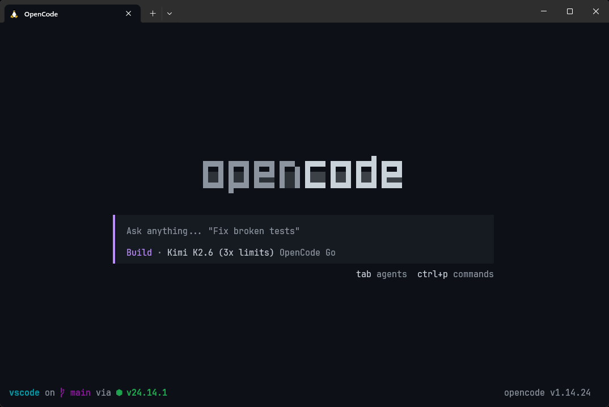

# oc-starship

An [OpenCode](https://opencode.ai) TUI plugin that renders the [Starship](https://starship.rs) shell prompt in the footer with full ANSI color support.



## Requirements

- [OpenCode](https://opencode.ai)
- [Starship](https://starship.rs) installed and available in `$PATH`

## Installation

Add the plugin to your OpenCode TUI config (`~/.config/opencode/tui.json`):

```json
{
  "plugin": [
    [
      "oc-starship",
      {
        // refresh every 3 seconds
        "interval": 3000,
        // show OpenCode version in the footer
        // "short" for "v1.2.3", "verbose" for "OpenCode v1.2.3", "off" to hide
        "opencodeVersionStyle": "short"
      }
    ]
  ]
}
```

## What It Does

The plugin registers a component in the `home_footer` slot that:

- Runs `starship prompt` periodically and renders the first line (info only, no prompt character)
- Parses ANSI escape codes into styled chunks so colors from your Starship config are preserved
- Uses `api.theme.current.textMuted` as the default color for unstyled text, so it matches your OpenCode theme
- Shows the current OpenCode version on the right side of the footer (configurable via `opencodeVersionStyle`)

## Notes

- Only the first line of `starship prompt` output is used. The second line (usually the prompt character `>` or `❯`) is discarded.
- Starship shell non-printing escape sequences (`%{…%}`) are stripped before parsing.
- The plugin runs `starship` from the current workspace directory so branch/status info is accurate.

## License

MIT
